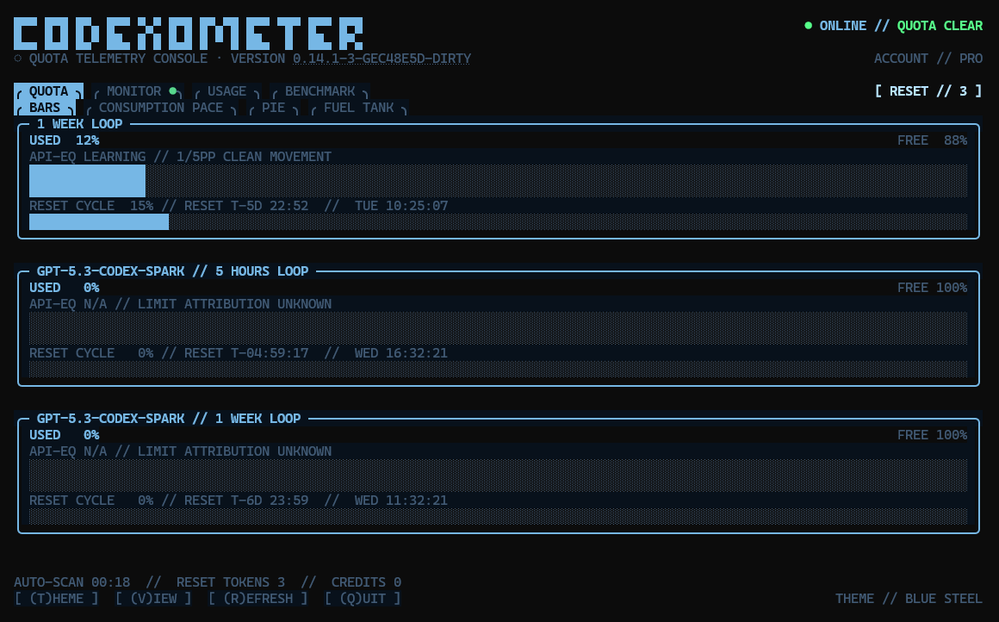

# Codexometer

Codexometer is a small, retro terminal dashboard for your current
[Codex](https://github.com/openai/codex) quota.
Keep it open in a second terminal window or pane and you can see every active
usage window, its remaining capacity, and its reset time without repeatedly
opening `/status` in your working Codex session.

```text
█▀▀ █▀█ █▀▄ █▀▀ ▀▄▀ █▀█ █▀▄▀█ █▀▀ ▀█▀ █▀▀ █▀█
█▄▄ █▄█ █▄▀ ██▄ █ █ █▄█ █ ▀ █ ██▄  █  ██▄ █▀▄
◉ QUOTA TELEMETRY CONSOLE // CRT-01 // SIGNAL LOCKED
```



_Hacker theme showing Codex and GPT-5.3-Codex-Spark quota windows._

Codexometer refreshes once a minute by default. Its quota dashboard is
read-only. The optional Benchmark tab starts model turns only when you
explicitly click its run button; those trials consume Codex quota.

## Why use it?

Codex already exposes quota information through `/status`, but that view lives
inside the session you are using. Codexometer is designed as a companion
display:

```text
┌──────────────────────────────┬──────────────────────────┐
│ Codex session                │ Codexometer              │
│                              │                          │
│ Editing, reviewing, coding   │ 5-hour window      62%  │
│                              │ Weekly window      37%  │
│ No need to interrupt work    │ Next reset     02:17:00  │
└──────────────────────────────┴──────────────────────────┘
```

It works particularly well in:

- another Windows Terminal tab or split pane;
- a second Terminal/iTerm window on macOS;
- a tmux, Zellij, or terminal-multiplexer pane;
- an Ubuntu terminal beside the Codex CLI.

## What it shows

- Every rate-limit bucket and window returned by the current Codex account,
  plus the effective monthly credit limit when supplied.
- Used and free percentages for each window.
- The duration of each window, such as five hours or one week.
- A live countdown and local clock time for each reset.
- On every Quota view, a separate reset-cycle gauge comparing elapsed window time
  with quota consumed. It uses the same active colour as its quota meter.
- A learned standard API-equivalent estimate for primary Codex windows of both
  quota consumed and inferred 100% capacity, including a range, sample count,
  and deliberately conservative confidence level.
- The current ChatGPT plan when Codex supplies it.
- Spend-control hard stops and available account-credit balance when supplied.
- Available earned reset credits when present.
- Online, refreshing, stale-data, and error states, with the limiting window
  named in warning states and a celebratory fresh-reset signal at 0% usage.
- A countdown to the next automatic refresh.
- An optional Monitor view that measures token activity between Go and Stop.
  Each independent local root session gets its own metrics and 30-second graph;
  explicitly linked spawned agents are included with their root.
- Highlighted per-session attention badges. A shared Codex app-server supplies
  exact `INPUT NEEDED` and `APPROVAL NEEDED` states. Without it, a completed
  open turn is definite `INPUT NEEDED`; an otherwise active session with no
  rollout activity for three minutes is cautiously labelled `CHECK SESSION`.
- An opt-in deterministic coding benchmark comparing every visible Codex model
  and supported reasoning effort by correctness, elapsed time, token use, and
  estimated standard API-equivalent cost.

Codexometer does not assume that every account has the same windows. Some
accounts expose a shorter rolling window and a weekly window; plans and backend
configuration can differ. The UI renders whatever the current Codex account
actually returns.

## Requirements

- The `codex` CLI installed and available on `PATH`.
- A current ChatGPT login in Codex.
- A modern terminal with ANSI color and Unicode support.

Go is required only when installing from source. A compiled Codexometer binary
does not require a Go runtime.

## Install

Once a release has been published, Go users can install directly:

```sh
go install github.com/merefield/codexometer@latest
```

`go install` places the executable in `GOBIN` when that setting is non-empty;
otherwise it uses the `bin` directory under `GOPATH` (normally
`$HOME/go/bin`). That directory must be on `PATH` to run `codexometer` from any
working directory.

On macOS or Linux, find the directory Go used:

```sh
go_bin="$(go env GOBIN)"
if [ -z "$go_bin" ]; then go_bin="$(go env GOPATH)/bin"; fi
printf '%s\n' "$go_bin"
```

Add the printed directory to your shell configuration. For a default Go setup,
add this line to `~/.zshrc` on macOS with Zsh, or `~/.bashrc` on Linux with
Bash:

```sh
export PATH="$PATH:$HOME/go/bin"
```

Restart the terminal, or reload the relevant file with `source ~/.zshrc` or
`source ~/.bashrc`.

On Windows, PowerShell can discover Go's install directory and add it to the
current user's persistent `Path` without requiring administrator access:

```powershell
$goBin = go env GOBIN
if (-not $goBin) { $goBin = Join-Path (go env GOPATH) "bin" }
$userPath = [Environment]::GetEnvironmentVariable("Path", "User")
if (($userPath -split ";") -notcontains $goBin) {
    $newUserPath = if ($userPath) { "$userPath;$goBin" } else { $goBin }
    [Environment]::SetEnvironmentVariable("Path", $newUserPath, "User")
}
```

Open a new terminal after changing the Windows `Path`. Confirm the command is
available everywhere:

```sh
codexometer --version
```

On macOS/Linux, `command -v codexometer` shows the resolved executable. In
PowerShell, use `Get-Command codexometer`.

To build the current checkout:

```sh
git clone https://github.com/merefield/codexometer.git
cd codexometer
go build -trimpath -ldflags="-s -w" -o codexometer .
```

On Windows, use `-o codexometer.exe` instead. The compiled executable is
standalone and does not require Go at runtime. Run it from the project directory
as `./codexometer` (or `.\codexometer.exe` in PowerShell), or copy it into any
directory already on `PATH`. A common per-user option on macOS/Linux is:

```sh
mkdir -p "$HOME/.local/bin"
install -m 0755 codexometer "$HOME/.local/bin/codexometer"
```

If you use that location, ensure `$HOME/.local/bin` is also included in `PATH`
using the same shell-configuration steps above. On Windows, a directory such as
`$HOME\bin` can be created, added to the user `Path`, and used for
`codexometer.exe`.

## Quick start

Start the dashboard:

```sh
codexometer
```

Confirm that Codexometer can use the prevailing Codex login without opening
the interface:

```sh
codexometer --check-auth
```

Preview all UI features using simulated quota data:

```sh
codexometer --demo
```

## Shared Codex daemon for precise Monitor status

Codexometer works without a shared server, but its `CHECK SESSION` fallback
cannot distinguish every long-running local tool from a prompt. On Unix
systems, a current standalone Codex installation can instead run one shared
app-server daemon. Every CLI connected to that daemon exposes its live
per-thread `waitingOnApproval` and `waitingOnUserInput` flags, allowing the
Monitor to show definite `APPROVAL NEEDED` and `INPUT NEEDED` badges.

Start the managed daemon and confirm that it is ready:

```sh
codex app-server daemon start
codex app-server daemon version
```

Then launch each Codex CLI terminal against its default Unix control socket:

```sh
codex --remote unix://
```

Run that client command in every terminal tab or pane that should share the
daemon. Start Codexometer normally in another terminal:

```sh
codexometer
```

No Codexometer option is required. While Monitor is recording, Codexometer
automatically probes the same default socket under `CODEX_HOME` and uses exact
runtime status for threads loaded there. Sessions belonging to ordinary,
non-daemon Codex processes continue to use the local rollout and writer-lock
fallback.

Manage or stop the daemon with:

```sh
codex app-server daemon restart
codex app-server daemon stop
```

The managed daemon lifecycle is currently experimental, Unix-only, and expects
the standalone Codex installation. The app-server also supports a local
WebSocket listener, including on Windows:

```sh
codex app-server --listen ws://127.0.0.1:4500
codex --remote ws://127.0.0.1:4500
```

Plain WebSockets should be used only on localhost or through an SSH tunnel.
Codexometer currently auto-detects only the default Unix daemon socket, so
WebSocket-connected sessions use its fallback attention detection for now. See
the official [Codex app-server documentation](https://developers.openai.com/codex/app-server)
for custom socket paths, secure remote connections, and authentication.

## Authentication and privacy

Codexometer starts `codex app-server` as a short-lived child process and asks
its account API for the current rate limits and account identity. The identity
is immediately reduced to the process-local fingerprint described below. The
child inherits the prevailing environment, including `CODEX_HOME`, so it uses
the same ChatGPT account and credential-refresh behavior as the installed Codex
CLI.

Codexometer deliberately does not:

- read or copy Codex credential/token files;
- implement a separate OAuth flow;
- store access or refresh tokens;
- send credentials to another service;
- invoke a model merely to discover quota information.

The Monitor and observed quota estimator additionally read locally persisted
Codex rollout files under `$CODEX_HOME/sessions` (normally
`~/.codex/sessions`). They decode `token_count` totals, each last response's
input/cache/cache-write/output counts, requested model name, timestamps, and
content-free turn timing,
plus the minimum session metadata needed for grouping: thread ID, parent thread
ID, source classification, working directory, and the inherited-history
boundary. It also reads lifecycle event names and blocking flags to identify an
explicit unresolved input or approval request. To distinguish an open CLI
waiting at its prompt from a closed historical session, it inspects the lock
state—not the contents—of Codex's per-thread writer lock. Message text—including
the final response carried beside timing
metadata—reasoning, commands, tool results, and credentials are ignored and
never retained by Codexometer.

If you use a nonstandard Codex executable, pass it explicitly:

```sh
codexometer --codex /path/to/codex
```

## Controls

| Key | Action |
| --- | --- |
| `t` | Cycle color themes |
| `Tab` | Select the next top-level tab: Quota, Monitor, or Benchmark |
| `Shift+Tab` | Select the previous top-level tab |
| `r` | Refresh quota data immediately |
| `v` | Cycle the active Quota view |
| `s` | Start recording (Monitor only) |
| `p` | Stop and take a final up-to-date reading (Monitor view only) |
| `b` | Run the selected challenge (Benchmark view only) |
| `a` | Arm, then confirm, Run All (Benchmark view only) |
| `[` / `]`, `Left` / `Right` | Select the previous or next challenge |
| `f` | Show all, passed, or failed benchmark results |
| `w` | Cycle Cost, Balanced, and Speed benchmark ranking weights |
| `Page Up` / `Page Down` | Scroll Monitor session rows or Benchmark result pages |
| `q` | Quit |
| `Esc` | Quit |
| `Ctrl+C` | Quit |

The responsive top rail below the account status selects Quota, Monitor, or
Benchmark by mouse, `Tab`, or `Shift+Tab`. Quota adds a second rail for Bars,
Consumption Pace, Pie, and Fuel Tank; select these with the mouse or cycle them
with `v`. Codexometer remembers the selected Quota view when you leave
and return. Both rails condense automatically as the terminal narrows.
The footer presents the remaining actions as clickable buttons, including View
only while Quota is active. Move the pointer over a tab or button to highlight
it, or click it to activate it. Controls pulse briefly when activated by mouse
or keyboard. The keyboard assignments remain available in terminals without
mouse support. Theme and tab changes are immediate and do not trigger a network
refresh. Theme, Quota view, benchmark result filter, and benchmark ranking
weight are restored on the next launch.

### Quota health signal

The top-right signal keeps `ONLINE` in the selected theme color while its dot
and quota-health label use fixed semantic colors. Warning labels identify the
meter responsible, for example `5 HOURS // WATCH`, `MONTHLY // NEAR`, or
`SPEND // EXHAUSTED`:

- green `RESET FRESH // GO!` — every returned meter currently reports 0% used;
- green `QUOTA CLEAR` — consumption is keeping pace with, or trailing, elapsed
  window time;
- blue `QUOTA WATCH` — the current average burn rate would exhaust at least one
  quota window before it resets;
- amber `LIMIT NEAR` — excess pace projects exhaustion within the first quarter
  of the time still remaining, or no more than 5% remains while over pace;
- red `QUOTA EXHAUSTED` — a window is at 100%, Codex explicitly reports its
  rate limit reached, or account spend control reports a hard stop.

Codexometer reports the worst state among all returned rolling windows and the
effective monthly credit limit. If reset timing or cycle duration is
unavailable, it conservatively falls back to remaining capacity: Watch at 20%
and Near at 5%. The monthly limit supplies a reset time but no cycle start, so
Codexometer never invents monthly elapsed progress. Scanning and stale-signal
states take precedence while quota health cannot be evaluated reliably.

For each window with valid duration and reset data, Codexometer calculates:

- `U`, the used quota fraction (`usedPercent / 100`);
- `E`, the elapsed window fraction, using `reset time - window duration` as the
  window start;
- remaining quota `1 - U` and remaining time `1 - E`;
- projected time to exhaustion, as a fraction of the complete window:
  `E × (1 - U) / U`.

It then applies these rules in severity order:

1. **Exhausted** if `usedPercent` is 100, Codex explicitly reports that a rate
   limit has been reached, or `spendControlReached` is true.
2. **Fresh** if every returned used percentage is zero.
3. **Clear** if `U <= E`: quota consumption is no further advanced than the
   reset cycle.
4. **Limit Near** when over pace and either no more than 5% quota remains, or
   projected exhaustion is within the first 25% of the time remaining to reset.
5. **Watch** for every other over-pace window (`U > E`).

This means 10% remaining can correctly stay Clear when less than 10% of the
window remains: quota is low, but reset is closer than exhaustion at the
observed average pace. Conversely, a window with plenty remaining can reach
Watch or Limit Near if it is being consumed very early and projects exhaustion
well before reset. Percentages are clamped to 0–100 before classification. If
duration or reset data is missing or invalid, pace cannot be calculated, so the
fallback is Clear above 20% remaining, Watch at 20% or less, Limit Near at 5%
or less, and Exhausted at 0%.

### Observed quota API equivalent

Every Quota presentation also learns an **observed standard API-equivalent**
for the primary `codex` rate-limit windows. Additional/model-specific limits
show `LIMIT ATTRIBUTION UNKNOWN`, because the rate-limit API does not say which
local model calls consumed those buckets. The primary windows show two estimates:

- `SPEND` / `NOW` — the inferred API-equivalent value of the percentage
  consumed in the current window;
- `100%` / `FULL` — the inferred API-equivalent value represented by an entire
  window under the workload Codexometer observed.

These figures are not an account balance, subscription valuation, token
allowance, invoice, or claim about OpenAI's private quota formula. They answer a
narrower question: “At published standard API text-token prices, roughly what
would this observed mix of model work cost when mapped onto the movement in my
quota meter?”

Codexometer prices each newly completed local model call using the requested
model durably recorded in its turn context. Current Codex rollout files do not
persist transient model-reroute events, so a server-side reroute cannot be
reconstructed from this local source; this is one reason confidence never rises
above Medium. Ordinary input, cached input, cache-write input, and output are
priced separately; requests above the published 272,000-input-token threshold
use the corresponding long-context rates where OpenAI publishes them. Unknown
models or missing price classes fail closed as `UNPRICED MODEL MIX` rather than
being guessed or treated as free.
The embedded rates come from the
[official OpenAI API pricing page](https://developers.openai.com/api/docs/pricing)
and were retrieved on **2026-08-13**.
Every Quota presentation repeats that retrieval date and a terminal hyperlink
to the source in its footer when the terminal is wide enough, matching the
Benchmark view and making stale compiled pricing conspicuous wherever a priced
figure appears.

Each refresh brackets the account quota request with local accounting reads.
If their cost or call counters differ, `OBSERVATION DEFERRED` is shown and no
sample is taken, preventing a response completed during the request from being
paired with the wrong quota snapshot. Learning starts with a stable quota
percentage and cumulative local API-equivalent cost anchor. Once the same
window advances by at least five displayed percentage points without a reset
or an unpriced call, a sample is calculated:

```text
central 100% estimate = observed API-equivalent cost × 100 / percentage-point movement
lower bound           = observed API-equivalent cost × 100 / (movement + 1)
upper bound           = observed API-equivalent cost × 100 / (movement - 1)
current spend range   = 100% range × current used percentage
```

The `±1` denominator reflects the integer granularity of the quota percentage.
For multiple samples the UI reports the median lower and upper bounds. One or
two clean samples are `LOW` confidence; at least three samples spanning 15 or
more percentage points can reach `MED` only when both their rounding ranges and
their central capacity estimates agree within conservative spread limits.
Confidence is intentionally capped at Medium because local telemetry cannot
prove that no other machine, cloud task, unobserved client, or server-side model
reroute also affected the account quota.

An interval is discarded and re-anchored if the window resets, the counters
regress, the quota moves five points without any matching priced local call, or
an unknown/unpriced model occurs. `LOCAL COVERAGE GAP` signals the unmatched
movement. Even a valid estimate can still vary with reasoning effort, model
mix, caching, prompt shape, and backend quota weighting, so compare ranges and
sample counts rather than treating the midpoint as a fixed entitlement.

Samples remain process-local and are never written to the preferences file, so
evidence cannot leak from one login into another on a later run. During a run,
Codexometer requests the current account email from the same local app-server,
immediately reduces it to an in-memory one-way fingerprint, and uses that only
to separate account observations. The email and fingerprint are not persisted.
If an older app-server cannot provide an account identity, the estimate fails
closed as `ACCOUNT ATTRIBUTION UNKNOWN` rather than mixing indistinguishable
accounts.
At most 12 samples per account/window are retained in memory and samples older
than 45 days are ignored. No token event, model-call record, prompt, response,
session ID, email, or account ID is stored. Run `codexometer --demo`, then
refresh once with `r`, to preview a learned estimate without consuming quota.

## Themes

Press `t` to cycle:

1. **Hacker** — the default green CRT telemetry console.
2. **Rust** — a warm amber monitor with weathered brown shadows.
3. **Blue Steel** — cool blue instruments on a dark slate background.
4. **Ultraviolet** — purple phosphor with magenta highlights and plum shadows.
5. **Nightshade** — vivid royal-purple instruments on a deep plum screen.

The default remains the original green hacker-terminal presentation.

## Views and quota presentations

The top-level tabs are **Quota**, **Monitor**, and **Benchmark**. Within Quota,
choose one of these four views with its sub-tab or `v`:

1. **Bars** — chunky quota bars, with one full-width rate-limit window per row.
2. **Pie** — clockwise-filled circles rendered on a 2×4 sub-cell Braille canvas
   for clean curves at any size.
3. **Consumption Pace** — a signed horizontal scale comparing elapsed window
   time with quota consumed. Positive headroom means consumption is behind
   elapsed time; a negative deficit means quota is being used too quickly. A
   clearly labelled linear projection reports `SAFE THROUGH RESET` or estimates
   how long remains until exhaustion and how early that is relative to reset.
4. **Fuel Tank** — a reverse gauge whose bright segment shows remaining range
   and whose dark segment shows consumed capacity, labelled from Empty to Full;
   one full-width tank appears per row. Its reset-cycle comparison also drains
   backward and aligns exactly with the tank's first and last inner cells.

The other top-level views are:

- **Monitor** — establishes a zero baseline across locally active Codex
  sessions when you press Start. A large readout follows newly appended token
  telemetry once per second and shows total observed tokens, elapsed time, and
  average rate; clickable Start and Stop controls sit beside it. Below, every
  independent root session has a metrics box and its own graph. Spawned-agent
  descendants with an explicit Codex parent link are recursively aggregated
  into the root row and reported as `ROOT + n AGENTS`. Each row compactly shows
  model calls and latest activity, latest/peak time to first token, and
  latest/peak output size. All graphs add one thin vertical block bar on the
  same 30-second tick, after a fresh boundary read. The companion readout
  records each account quota window at Start and tracks its observed change
  while recording. Every session row shows its exact share of locally observed
  tokens and an explicitly labelled, local-only estimate of the first quota
  window's movement, apportioned by that share. A root discovered part-way
  through an interval gets an honestly labelled partial first bar and its rate
  uses that root's own observed lifetime. New bars enter on the right, older
  bars move left, and each Y axis automatically rescales to its visible samples.
  An open root or linked child whose latest durable lifecycle event says its
  turn completed receives an amber `INPUT NEEDED` badge and border until a new
  turn starts or the CLI closes. When Codexometer finds the default shared
  Codex app-server socket, it reads the server's per-thread runtime status and
  uses the exact `waitingOnApproval` and `waitingOnUserInput` flags for
  `APPROVAL NEEDED` and `INPUT NEEDED`. If no shared server is available, an
  otherwise active open session with no new token or rollout activity for three
  minutes receives `CHECK SESSION`: a deliberately uncertain prompt that can
  also mean a long-running local tool. Any subsequent activity clears it.
  Codexometer never guesses `APPROVAL NEEDED` from inactivity. Closing the CLI
  releases its per-thread writer lock and clears every attention badge.
  A session already included in the current Monitor recording can remain as an
  `IDLE` historical row so its completed metrics and graph are not discarded.
  When the terminal cannot fit every root, use Page Up, Page Down, or the mouse
  wheel to page through the rows. Stop performs an immediate final local read
  instead of relying on the latest graph sample.
- **Benchmark** — runs a selected hermetic coding challenge, or the complete
  challenge catalog, against every visible model and each reasoning effort
  that model advertises. Results arrive sequentially in a ranked table with
  task, pass/fail, wall time, tokens, and estimated standard API-equivalent cost.
  Filter the table to all, passed, or failed trials. Scroll a long result matrix
  with Page Up, Page Down, or the mouse wheel. Click any column-heading button
  to sort by that field; click it again to reverse the order.

The layout responds to both terminal dimensions and the number of rate limits
returned by Codex. Header, status, errors, footer, and meter grid divide the
available rectangle proportionally. Bars, Consumption Pace, and Fuel Tank flow
one meter per row. Codexometer does not hardcode the currently returned window
set: it renders every primary and secondary window from every limit bucket,
including a 300-minute window as `5 HOURS`, plus an effective monthly credit
limit when present. When more limits arrive,
horizontal views remove decorative row gaps before compressing the cards, while
Pie adds rows or columns only when each radial card retains a useful width.
Meter rows always use identical heights; indivisible spare rows become quiet
space above the footer instead of stretching one quota block more than another.
Pie uses at least two columns when multiple limits exist, adding rows when that
preserves more radial detail and adding columns when the terminal is wide
enough. Consumption Pace calculates `elapsed window % - quota used %`, placing
under-budget consumption on the positive side and over-budget consumption on
the negative side. Its linear projection assumes the average burn observed
since the calculated cycle start continues unchanged: remaining time is
`elapsed time × (1 - U) / U`. It reports safe when the resulting exhaustion
time falls at or after reset, and hides the projection when timing is
insufficient. This is a trend estimate, not a backend forecast. Every Quota view
also shows a `RESET CYCLE` comparison:
its label and countdown occupy one line, while its progress bar occupies a
separate line with the same width and active colour as the main visualization.
Its percentage is elapsed time from the calculated window start
(`reset - duration`) to the next reset. When Codex supplies a monthly reset but
not a cycle start, the card says `CYCLE START UNAVAILABLE`, shows the known
countdown, and leaves the comparison bar unfilled. Every visualization
receives its card's remaining width and height, and resizing the terminal
immediately reflows and rescales it. The underlying values and reset information
never change with presentation.

The Monitor is deliberately separate from the percentage gauges: no token
ceiling is exposed for those quota windows, so a percentage-based bar would be
misleading. It follows the local token telemetry underlying Codex's live
[`thread/tokenUsage/updated`](https://developers.openai.com/codex/app-server)
data, rather than the delayed account activity
summary. A separate process cannot subscribe to another Codex process's
app-server connection, so Codexometer incrementally observes the equivalent
`token_count` records written to local rollout files.

This is local activity telemetry, not account-wide billing data. It can combine
multiple sessions using the same local `CODEX_HOME`, but it cannot see Codex
activity on another computer, in a different Codex home, or in a cloud session
that is not writing locally. Token totals normally appear when Codex emits usage
for a model response, not token-by-token while a response is streaming. Raw token
counts also do not reveal or reproduce the backend's quota-weighting rules, so
they should not be converted directly into the percentage gauges.

Session rows represent recently active rollout roots plus open CLI sessions
waiting for input, not a guaranteed list of every terminal process. Two
independent CLI tabs have different root thread IDs and therefore remain
separate rows.
`thread_spawn` descendants,
including nested descendants, are folded into their root by following persisted
parent IDs. Review, compact, or other internal work that lacks an explicit
parent is never guessed onto a root; if observed, it appears in an
`UNATTRIBUTED // INTERNAL` row. When Codex records inherited child history, the
Monitor honors its ownership boundary so copied parent telemetry is not counted
twice. Legacy spawned-agent rollouts without an ordinal boundary are separated
at the child session timestamp: inherited cumulative totals establish the child
counter baseline but are not reported as new usage.

Attention detection reads only content-free lifecycle metadata, per-thread
writer-lock state, and—when available—the shared app-server's runtime thread
status. A held writer lock plus a completed turn reliably identifies an open
CLI waiting at its prompt. Without a shared server, three minutes without any
new rollout-file activity produces only `CHECK SESSION`, because persisted data
cannot distinguish an approval wait from every long-running local tool. The
Monitor does not retain the input question, approval text, response, or
conversation content. A linked child's attention state is folded into its root
so one remote Monitor row identifies the CLI session that needs intervention.
A definite approval signal takes precedence, then definite input, then the
inferred check state when linked members have mixed states.

`CALLS` counts upstream model-response cycles observed after Monitor Start, not
complete user turns. A single Codex turn can make several calls while using
tools or progressing through an agent loop. `LAST OUT` is the provider-reported
output-token count for the latest such call. `TTFT` comes from the completed
turn's persisted time-to-first-token measurement; older Codex rollouts that do
not contain it display `N/A`. Spawned descendants contribute these pulses to
the same root row as their token activity.

The Monitor's per-session quota figure is an estimate, not API attribution.
Codex exposes account-level quota percentages and local per-session token
telemetry separately; it does not report which session consumed each percentage
point. Codexometer therefore multiplies the observed account-wide change by a
session's share of locally observed tokens. This assumes that no activity from
another computer, cloud session, different `CODEX_HOME`, or otherwise invisible
client changes the account quota during the recording; if it does, its movement
cannot be separated and will contaminate the estimate. Model choice, reasoning
effort, cache behavior, and private backend weighting can also make equal token
counts affect quota differently.

The UI calls this `EST LOCAL-ONLY`, uses percentage points (`PP`), and never
presents finer precision than the whole-number quota percentage returned by
Codex. `NO INTEGER Δ` means no whole-point movement was observed, not necessarily
zero consumption; a smaller apportioned estimate is shown as `<1PP`. Stale,
missing, late-baseline, and reset-crossing windows do not produce a per-session
number.
Start reads quota before establishing the local token baseline, while Stop reads
local tokens before the final quota snapshot, so the account observation
brackets the local interval. These operations are not atomic, so unrelated
account activity during either short boundary read remains another source of
uncertainty.

### Saved presentation preferences

Codexometer stores only the selected theme, Quota view, benchmark filter, and
benchmark ranking weight. No quota estimate or snapshot, raw session telemetry,
benchmark result, message content, credential, session ID, email, account
fingerprint, or account ID is written. The small JSON file uses the
platform-standard user configuration directory:

- Linux: `$XDG_CONFIG_HOME/codexometer/preferences.json`, normally
  `~/.config/codexometer/preferences.json`;
- macOS: `~/Library/Application Support/codexometer/preferences.json`;
- Windows: `%AppData%\codexometer\preferences.json`.

Missing, unreadable, or malformed preferences never prevent startup;
Codexometer falls back to its safe defaults.

### Deterministic benchmark

The Benchmark tab discovers the current account's visible models and their
supported reasoning efforts through `model/list`. Select any challenge with the
arrow buttons; the selector reserves a stable responsive track for the longest
name, so its controls do not move as the selection changes. Press `b` or click
**Run Selected** to run that challenge against every model/effort combination.
**Run All** runs the complete catalog against every combination. Because that
means `challenge count × model/effort count` model turns, Codexometer displays
the exact total and requires a second confirmation within five seconds. A fresh,
ephemeral, read-only app-server thread is used for each trial, so benchmark
history does not clutter normal Codex sessions. The turns still consume the
same account quota shown by Codexometer.

Each model/effort trial has a five-minute deadline. If an in-flight turn reaches
that deadline, Codexometer requests `turn/interrupt`, waits for the matching
`turn/completed` event, records that combination as `FAIL`, and continues with
the remaining combinations. Explicit user cancellation, app-server transport
failure, or failure to confirm interruption still stops the suite because the
server's state is then unsafe or unknown.

#### Challenges and difficulty

Every trial asks the model to return one named Starlark function:

| Challenge | Difficulty | Required behavior | Verification set |
| --- | --- | --- | --- |
| **Merge Ranges** | Easy | Sort inclusive integer ranges and merge every overlapping or adjacent pair into a canonical union. It must handle empty input, duplicates, nesting, negatives, and arbitrary order. | 8 hand-written edge cases + 48 reproducibly generated cases |
| **LRU Cache** | Moderate | Process integer `put` and `get` operations, update recency, evict the least-recently-used entry, and return both get results and final entries in most-recently-used order. Capacity zero is valid. | 5 hand-written edge cases + 40 reproducibly generated cases |
| **Expression** | Moderate | Evaluate tokenized non-negative integers with `+`, `-`, `*`, parentheses, normal precedence, and left associativity—without `eval`. | 8 hand-written edge cases + 40 reproducibly generated expressions |
| **Shortest Path** | Moderate | Return the minimum four-direction move count through a rectangular blocked/open grid, or `-1` when no route exists. | 5 hand-written edge cases + 40 reproducibly generated mazes |
| **Dependency Scheduler** | Hard | Find the minimum makespan for a small dependency DAG with job durations and a limited number of identical workers. Correct solutions must reason about precedence, concurrency, and cases where immediately starting every available job is not optimal. | 6 hand-written edge cases + 8 reproducibly generated DAGs |
| **Version Resolver** | Hard | Select one version per package while satisfying inclusive dependency ranges and exact conflicts, then return the lexicographically greatest valid solution. | 5 hand-written edge cases + 12 reproducibly generated catalogs |
| **Event Processor** | Hard | Reorder ledger events by sequence and apply idempotency, transfers, freezes, reversals, failure precedence, and a canonical audit result. | 5 hand-written edge cases + 10 reproducibly generated event streams |

The difficulty labels are documentation rather than part of the terminal names.
Hard challenges deliberately combine more rules or require bounded search, which
should create more separation between models and reasoning efforts than simply
making the easier inputs larger.

#### Ranking

The `RANK` column is an overall ranking for each model/reasoning-effort
combination across every completed row currently in the result matrix. It uses
ordinal cost and time positions—not raw dollars and seconds—so the distance
between first and second place on either axis is always one rank position,
regardless of the difference in the underlying measurements.

The algorithm is:

1. Group completed rows by requested model ID and reasoning effort. A reported
   model reroute remains part of the requested combination that produced it.
2. For each combination, count passes and failures, sum non-negative wall time,
   and sum API-equivalent cost. Cost is complete only when every row in that
   combination has a finite, non-negative cost measurement.
3. Partition combinations into correctness tiers with identical pass and
   failure counts. Within each tier, rank combinations independently by
   ascending total cost and ascending total wall time. Equal measurements share
   a competition rank: for example, `1, 2, 2, 4`. Every incomplete-cost
   combination ties on the cost axis after every cost-complete peer in its tier.
4. Calculate a lower-is-better weighted score from cost rank `C` and time rank
   `T` according to the selected mode:

   | Mode | Formula | Equivalent weighting |
   | --- | --- | ---: |
   | **Cost** | `3C + T` | 75% cost / 25% time |
   | **Balanced** | `C + T` | 50% cost / 50% time |
   | **Speed** | `C + 3T` | 25% cost / 75% time |

5. Produce the final order lexicographically: more passes first, then fewer
   failures, then lower weighted score. Correctness therefore always dominates
   efficiency; a cheap, fast failure cannot outrank a combination with more
   passes. Combinations equal on all three comparisons share a competition rank.

Click **Cost**, **Bal**, or **Speed** in the Result Matrix control row, or press
`w` to cycle them. The ranking is recomputed immediately without rerunning any
trial. Token counts remain visible diagnostics but do not affect rank. The same
overall rank is repeated on each task row for that combination, and the rank
heading is clickable like the other sortable headings.

Missing cost is penalized on the cost axis, but it does not automatically force
the combination to the bottom of the final table. A sufficiently strong time
rank can still compensate in Balanced or Speed mode. If every combination lacks
cost, they all tie on the cost axis and the final efficiency order is determined
by time in every mode. If only part of a combination's cost ledger is missing,
its known costs are not used to infer a partial position: the whole combination
is treated as cost-incomplete.

Rankings update as results arrive, so they are provisional until a run finishes.
Cost and time axes are recalculated among peers in the same current correctness
tier. During a task-major Run All execution, one combination can temporarily
have one more completed row than the others, so an in-progress rank should not
be compared with the final result.
They inherit the API-equivalent caveats below; in particular, unknown prices
sort behind complete measurements on the cost axis and prompt-cache order can
affect that axis. Correctness remains the dominant criterion.

#### How PASS and FAIL are decided

There is no LLM judge and no subjective scoring. Codexometer loads the returned
function into its embedded Starlark interpreter, runs every case for that
challenge, computes the expected result with a separate Go reference
implementation, and compares the values exactly. It also snapshots the input
and rejects a solution that mutates it.

A row is `PASS` only when all of the following are true:

- the turn completes and returns the required strict JSON object containing
  Starlark source;
- the source loads, defines the correctly named callable, and stays within the
  64 KiB source limit and the difficulty-appropriate per-case execution budget:
  250,000 steps for Easy/Moderate challenges or 2,000,000 steps for Hard challenges;
- every hand-written and generated case returns the exact reference answer with
  the required type and bounded shape; and
- the turn does not emit a tool-use item; and
- none of the supplied inputs are mutated.

Any syntax/runtime error, timeout, malformed response, wrong type or value,
mutation, safety/size-limit violation, or failed case produces `FAIL`. The first
failure is retained as the row's diagnostic. The test data is deterministic, so
the same Codexometer version judges every model/effort combination identically.

Starlark is a deliberately small, Python-like embedded language. Every prompt
includes the same compact language contract—available statements and built-ins,
plus the absence of `while`, recursion, imports, `load`, and `eval`—to reduce
advantage from prior syntax familiarity. It cannot remove that advantage
entirely: these results measure algorithmic coding through Starlark and may
favor models stronger at Python-like languages. They are not a language-neutral
measure of general model quality.

Codexometer links the Starlark interpreter into the standalone binary and
exposes no filesystem, process, network, clock, or environment capabilities to
submitted code. Restricted return types and bounded result sizes add further
containment.

#### Interpreting token and API-equivalent figures

Codexometer asks the local app-server for its opt-in `rawResponse/completed`
telemetry and, when a complete valid ledger is available, sums the exact usage
reported for each upstream response in the turn. Because that event is an
internal experimental Codex interface, older app-servers may reject or omit it;
Codexometer then falls back automatically to the final cumulative
`thread/tokenUsage/updated` value for the fresh one-turn thread. Both event types
are matched to the expected thread and turn IDs so activity from another trial
or Codex session is not included.

Before displaying either source, Codexometer checks that all token fields are
non-negative, cached plus cache-write input does not exceed total input,
reasoning output does not exceed output, total equals input plus output, and
cumulative updates never regress. When both complete raw-response and cumulative
telemetry are present, their totals must agree. A valid cumulative total can
stand in for an omitted raw usage payload; otherwise missing, duplicate, or
inconsistent telemetry displays `N/A`. It is never silently converted to zero
or clamped into a plausible value, and the status panel retains the reason.

The displayed total includes all reported input tokens—including cached input
and cache-write input—and all reported output tokens. Reasoning tokens are
already included in the output-token total and are not added a second time.

`API EQ` is an estimated **standard text-token API equivalent**,
not a bill, a ChatGPT subscription charge, or a prediction of how much account
quota the turn consumed. Codexometer separates ordinary input, cached input,
cache-write input, and output, then applies the per-million-token prices known
to this Codexometer release. Usage availability and price availability are
tracked separately: a valid token total can still have `API EQ` shown as `N/A`
for an unknown model or a token class whose price was not published when the
release was built. Codexometer does not inherit or guess such a price. Pricing
can change after a binary is released; consult the
[official OpenAI API pricing page](https://developers.openai.com/api/docs/pricing)
for current values. The rates compiled into this version were retrieved from
that page on **2026-08-13**; every pricing-bearing Quota or Benchmark footer
displays both the retrieval date and a terminal hyperlink to the source when
space permits, so stale embedded pricing is visible while interpreting results.

The figures are useful for comparing these particular observed trials, but
they have important limitations:

- They do not reveal the private quota-weighting rules used by ChatGPT plans,
  and should not be converted into quota percentages or treated as dollars
  actually charged.
- Prompt-cache state can depend on earlier activity and benchmark order. A
  later trial may receive cheaper cached input or incur a cache write that an
  otherwise identical trial would not, so observed API-equivalent cost is not
  a cache-neutral ranking.
- When exact per-response usage is present, long-context price thresholds are
  applied to each response independently. A cumulative-only turn beyond the
  threshold displays `N/A`, because its response boundaries cannot be proven.
  The raw event still does not associate a distinct model with each response.
- If Codex reroutes a turn, usage is priced using the final reported model. A
  turn that actually spans differently priced models cannot be reconstructed
  exactly without a response-to-model association.
- Tool use is prohibited for these hermetic trials. If a tool-use item is
  observed, the row is forced to `FAIL` and `API EQ` is `N/A`, even when valid
  text-token telemetry was also reported.
- Exact raw-response telemetry is an internal experimental app-server facility
  and may change independently of Codexometer. The validated cumulative path is
  retained for compatibility, but it does not preserve a response-by-response
  ledger.
- Model-specific Codex instructions and tool descriptions are part of reported
  input usage. That is appropriate when comparing the real Codex experience,
  but it is not a measurement of the challenge prompt in isolation.

PASS/FAIL evaluation is independent of these measurements: incomplete or
ambiguous token telemetry does not make an incorrect program pass, and a valid
program can still have an unavailable or approximate cost.

#### Measurement hardening status and guidance

The measurement path is deliberately fail-closed. Its current hardening status
is:

| Priority | Safeguard | Status |
| --- | --- | --- |
| **P0** | Distinguish missing telemetry from a genuine observed zero | Complete |
| **P0** | Reject negative, inconsistent, regressing, or overflowing token data | Complete |
| **P0** | Track token availability independently from price availability and retain the reason for `N/A` | Complete |
| **P1** | Prefer a validated per-response ledger, with a validated cumulative compatibility fallback | Complete |
| **P1** | Detect prohibited tool-use items, force the trial to `FAIL`, and invalidate `API EQ` | Complete |
| **P1** | Apply the correct pricing tier to long-context responses | Complete for exact per-response telemetry; ambiguous cumulative-only long contexts fail closed |
| **P2** | Reduce cache-order bias with balanced warm-ups, randomized ordering, or repeated trials | Open |
| **P2** | Report a cache-neutral comparison alongside the observed cached cost | Open |
| **P2** | Price mixed-model reroutes from a response-to-model association | Open; the current raw event does not expose that association |
| **P2** | Record pricing-table provenance and make stale compiled pricing conspicuous | Complete; every pricing-bearing Quota or Benchmark footer shows its source and retrieval date when space permits |
| **P2** | Add explicit compatibility diagnostics for future experimental-event schema changes | Complete for usage objects; unknown token fields fail closed and older servers retain the cumulative fallback |

Future accounting changes should preserve these rules:

- Never treat absent or invalid telemetry as zero, and never clamp malformed
  fields into a plausible value.
- Validate individual responses, overflow-safe aggregates, cumulative
  monotonicity, and raw-versus-cumulative agreement before setting usage as
  available.
- Keep correctness, usage availability, and cost availability as independent
  states. An unavailable price must not erase a valid token count, and a
  measurement problem must not change the deterministic Starlark verdict.
- Prefer exact response telemetry only when response IDs are present and unique;
  retain the cumulative path for compatible older app-servers.
- Do not infer prices for unknown models or unpublished token classes. Unknown
  usage fields must make costing unavailable. Update the compiled table only
  from published OpenAI pricing, and update its source retrieval date at the
  same time.
- Treat any tool-use item as a benchmark protocol violation. Text-token pricing
  alone cannot represent separately priced or externally executed work.
- Cover missing fields, invalid invariants, integer overflow, duplicate events,
  event regression, source disagreement, tool use, and experimental-protocol
  fallback in tests. Keep race-enabled CI green on Linux, macOS, and Windows.

Correct mixed-model reroute costing will require each upstream response to be
associated with the model that actually served it. Cache-neutral or
repeated-trial reporting would improve comparison quality without changing the
deterministic PASS/FAIL verifier.

## Options

```text
--codex PATH       path to the Codex CLI (default: codex)
--check-auth       verify the current Codex login and exit
--demo             use simulated quota data
--inline           render inline instead of using the alternate screen
--refresh DURATION refresh interval (default: 1m)
-v, --version      print the version and exit
```

Examples:

```sh
# Refresh every 30 seconds
codexometer --refresh 30s

# Keep output in terminal scrollback rather than using a full-screen buffer
codexometer --inline

# Use a separately installed Codex build
codexometer --codex ~/bin/codex
```

## Platform builds

Codexometer uses pure Go and cross-compiles without CGo. Each operating system
and CPU architecture needs its own executable.

```sh
mkdir -p dist

GOOS=darwin  GOARCH=arm64 go build -trimpath -o dist/codexometer-darwin-arm64 .
GOOS=darwin  GOARCH=amd64 go build -trimpath -o dist/codexometer-darwin-amd64 .
GOOS=linux   GOARCH=arm64 go build -trimpath -o dist/codexometer-linux-arm64 .
GOOS=linux   GOARCH=amd64 go build -trimpath -o dist/codexometer-linux-amd64 .
GOOS=windows GOARCH=arm64 go build -trimpath -o dist/codexometer-windows-arm64.exe .
GOOS=windows GOARCH=amd64 go build -trimpath -o dist/codexometer-windows-amd64.exe .
```

The destination machine needs Codex installed and logged in, but it does not
need Go or Codexometer's source dependencies.

## Versioning

Codexometer follows semantic versioning; the current source version is
`v0.7.2`. The Git tag is the release source of truth. Go automatically embeds
that tag in binaries built with
`go install github.com/merefield/codexometer@v0.7.2`; direct source builds fall
back to the maintained value in `internal/version/version.go`.

Both forms report the embedded version and exit without starting the interface:

```sh
codexometer -v
codexometer --version
```

Release automation can override the source-build fallback without editing code:

```sh
go build -ldflags="-s -w -X github.com/merefield/codexometer/internal/version.Fallback=0.7.2" .
```

## How refresh works

At startup and on each refresh, Codexometer:

1. starts `codex app-server --stdio`;
2. performs the app-server initialization handshake;
3. requests `account/rateLimits/read`;
4. renders every returned limit bucket and window;
5. shuts down the short-lived app-server process.

Automatic refreshes occur once a minute unless `--refresh` changes the
interval. Pressing `r` refreshes immediately. If a refresh fails after valid
data has already been displayed, Codexometer retains the last snapshot and
marks it as stale instead of blanking the dashboard.

While the Monitor is recording it checks appended local token telemetry once per
second, groups explicit agent descendants under their root, and rolls each
root's observed deltas into synchronized graph buckets. It also updates the
three compact response-cycle statistics without retaining response content. A
bucket closes only after the boundary telemetry read completes; its heading
reports the actual observed duration when scheduling or first-session detection
makes it shorter or longer than 30 seconds. These reads do not contact OpenAI or
invoke a model.
On Unix systems, each read also probes the default shared app-server control
socket. When present, its loaded-thread runtime statuses make attention badges
exact; when absent or unreachable, Codexometer silently uses the local rollout
and writer-lock fallback described above.
Pressing Stop performs one immediate final local read and forces complete
session discovery, including Codex sessions resumed from older rollout
directories.

## Troubleshooting

### `Codex CLI not found`

Confirm that `codex --version` works in the same shell. Otherwise use
`--codex PATH`.

### Authentication check fails

Run:

```sh
codex login status
codexometer --check-auth
```

Codex rate-limit data requires a ChatGPT-backed Codex login. An API-key login
uses API billing and rate limits instead of ChatGPT subscription windows.

### Colors or symbols look wrong

Use a terminal with true-color and Unicode support, such as Windows Terminal,
the current macOS Terminal, iTerm2, or a modern Linux terminal. Ensure the
selected font includes block, arrow, and emoji glyphs.

### The terminal is too small

Codexometer adapts its header and meter widths, but rich gauges need enough
rows to display every quota window. Increase the pane height or press `v` in
Quota to return to the compact default Bars view.

### Monitor remains at zero

The Monitor observes rollout telemetry under the same `CODEX_HOME` visible to
the Codexometer process. Confirm that the Codex session doing work is local and
uses that home. A native Windows Codex session and a native Windows Codexometer
normally share the same user profile; WSL and native Windows have different
homes unless `CODEX_HOME` is deliberately shared. Cloud activity and sessions on
other machines are not visible. Usage is generally appended after a model
response reports its token totals, so a currently streaming response may not
appear until its next telemetry event.

## Development

Format, test, and vet the project:

```sh
gofmt -w .
go test ./...
go vet ./...
```

Measure test coverage:

```sh
go test -cover ./...
```

Codexometer uses:

- Go 1.25+
- Bubble Tea for the terminal event loop
- Lip Gloss for adaptive ANSI styling
- Starlark for deterministic, hermetic benchmark-code evaluation
- Codex app-server JSON-RPC for authenticated quota data
- Local Codex rollout `token_count` records for live Monitor telemetry

## License

Codexometer is available under the [MIT License](LICENSE).
